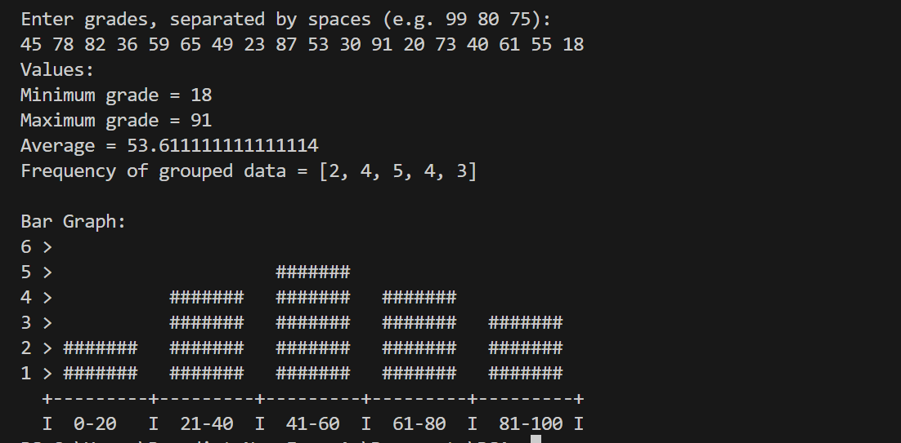

# Statistics of Grades

## Overview
This program takes a number of grades as input from the user and performs several statistical operations. It calculates the minimum, maximum, and average grades, and then generates a bar graph to display the distribution of grades across defined ranges. This project demonstrates array manipulation, sorting, and console output formatting.

## Features
- Prompts the user to enter grades.
- Finds the minimum and maximum grade.
- Calculates the average grade.
- Groups the grades into five ranges: 0-20, 21-40, 41-60, 61-80, and 81-100.
- Displays a bar graph to show the frequency of grade in each range.

## Sample Input and Corresponding Output

