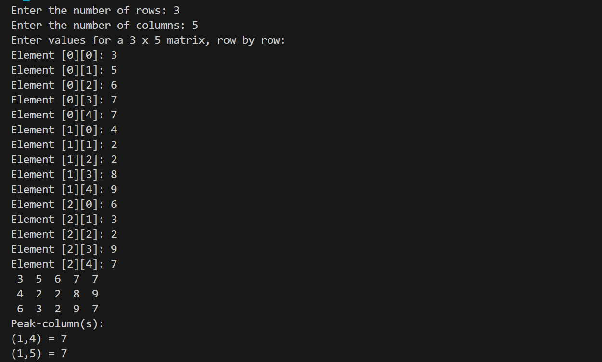

# Peak Column Finder

## Introduction
This Java program identifies elements in a given matrix that are both the maximum in their row and the minimum in their column. These elements are known as "peak columns." This program outputs the positions and values of all peak columns in a user-defined matrix.

## Features
- Prompts the user to enter the number of rows and columns of the matrix (matrix dimension).
- Allows user to input elements one after the other.
- The matrix is displayed in a clear, organized format.
- Checks each element in the matrix to see if it is both: 
  - The maximum element in its row.
  - The minimum element in its column.
- If both conditions are met, the element is considered a peak column.
- Displays the positions and values of all identified peak columns
- If no peak columns are found, it outputs a message indicating that no peak columns were detected in the matrix.
- Provides error handling for non-integer inputs.

## Sample run
